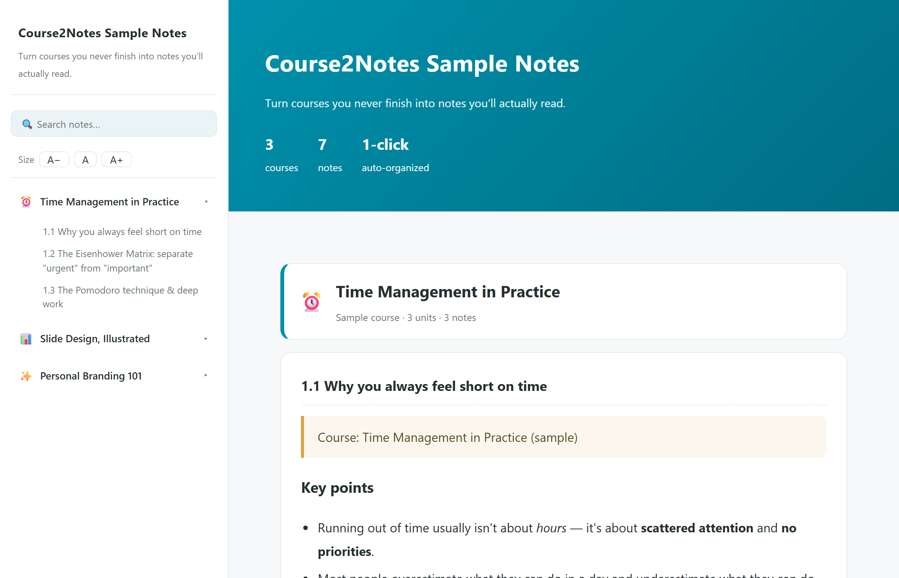

# Course2Notes

> Turn the online courses you **never finish** into notes you'll **actually read** — in one click, from inside Claude Code.

**English** · [中文](#中文-course2notes)　|　License: MIT · Author: Dr. Yu-Chieh Chen



Course2Notes is an open-source **[Claude Code](https://www.claude.com/product/claude-code) skill**. Point it at a course you've bought, and it turns the whole thing into one clean, self-contained **HTML** you can actually read. It runs on **your own computer and your own AI** — the author never sees your content. (Transcription is local when you have a GPU; without one, the OpenAI API mode uploads only the audio to OpenAI — see [Privacy](#privacy).)

You don't run any commands or need any tech skills: you just **talk to Claude Code**, and it installs itself, opens the browser, downloads, transcribes, and writes the notes for you. The only thing you do by hand is log in to your course platform.

## Why it's different

- **Works on the courses you actually paid for.** Most tools only handle public YouTube, or scrape whatever captions a platform happens to expose. Course2Notes drives your own logged-in browser, so it reaches courses **behind a login wall** — Teachify, 知識衛星, Hahow, LearnDash, and the like — not just free videos.
- **Adaptive, not a fixed scraper.** It doesn't rely on brittle per-site scrapers (the kind that break every time a platform changes its HTML). Your Claude Code **reads each platform on the fly** and figures out how to grab it — so it adapts to many different course sites.
- **Runs on your machine, your AI.** You use your own Claude Code and your own compute, and **the author never receives any of your content**. With an NVIDIA GPU (Windows/Linux) or an Apple Silicon Mac, transcription runs locally and your audio never leaves your computer; otherwise the OpenAI API mode sends only the audio to OpenAI to transcribe (the transcript is then written into notes by your own Claude Code either way — see [Privacy](#privacy)).
- **Beautiful HTML — no Notion, no account.** The output is a single self-contained HTML file with a lot packed in: an auto **course map** (every unit + a one-line summary, click to jump), colored **callouts** (key points / quotes / warnings / rebuilt figures), embedded **slide screenshots** with click-to-enlarge (for slide courses), an interactive **quiz + flashcards** to test yourself, checkable **to-dos** that remember your progress, plus sidebar nav, live search, adjustable font size, and print-to-PDF. Opens in any browser, offline, yours forever.
- **Private by design.** Anonymous usage counts only — never your notes, course names, URLs, or files. See [Privacy](#privacy).

## What you need

- **Claude Code** — the **desktop app (Local mode)** or the **CLI**. *(The web version, claude.ai/code, runs in the cloud and can't reach your computer, so it won't work.)*
- **Node.js**, **Python**, **ffmpeg**, and **Google Chrome** — you don't need to know what these are or install them yourself: the first time it runs, Claude Code checks for them and offers to install any that are missing (you just approve).
- **Transcription**: an **NVIDIA GPU** (Windows/Linux) **or an Apple Silicon Mac** — both do free, local Whisper, and the skill installs what each one needs — or, with no GPU / on an Intel Mac, an **`OPENAI_API_KEY`** (create one at [platform.openai.com/api-keys](https://platform.openai.com/api-keys), billing required; ~US$0.006/min).
- Desktop only. You must own the course and be able to log in to it.

> **(Advanced — you can skip this whole box; it's only for people installing by hand.)** The skill installs its own libraries automatically the first time it runs — `playwright-core` (via `npm install`) plus `yt-dlp` and the Whisper/OpenAI transcription packages (via `pip`). You don't install those by hand. Prefer to do it yourself? Inside the skill folder run `npm install`, then `pip install -r requirements.txt` plus **one** transcription set: `requirements-gpu.txt` (NVIDIA GPU on Windows/Linux), `requirements-mac.txt` (Apple Silicon Mac), or `requirements-api.txt` (Intel Mac / no GPU). If `pip` says `externally-managed-environment` (Homebrew or Debian/Ubuntu Python), add `--break-system-packages`.

## Install

**1. Get Claude Code** — pick one:

- **Desktop app** (recommended, no terminal): https://code.claude.com/docs/en/desktop — open it and choose **Local** mode.
- **CLI**:
  - macOS / Linux: `curl -fsSL https://claude.ai/install.sh | bash`
  - Windows (PowerShell): `irm https://claude.ai/install.ps1 | iex`

**2. Install this skill** — in Claude Code, just say:

```
Install the skill from github.com/Nouischen/course2notes into ~/.claude/skills/course2notes — I'll use it to turn online courses into notes
```

Then **restart Claude Code once** so the skill loads.

<details>
<summary>What Claude actually does (or do it yourself)</summary>

The skill must end up at `~/.claude/skills/course2notes/SKILL.md` — that exact location is how Claude Code discovers it.

- With git — macOS/Linux: `git clone https://github.com/Nouischen/course2notes ~/.claude/skills/course2notes` · Windows (PowerShell): `git clone https://github.com/Nouischen/course2notes "$env:USERPROFILE\.claude\skills\course2notes"`
- No git? Download [main.zip](https://github.com/Nouischen/course2notes/archive/refs/heads/main.zip) and extract it there. The zip unpacks to a folder named `course2notes-main` — rename it to `course2notes` so `SKILL.md` sits directly under `~/.claude/skills/course2notes/`.
- As a plugin (if you use `/plugin`): `/plugin marketplace add Nouischen/course2notes` then `/plugin install course2notes@course2notes`; update later with `/plugin update course2notes@course2notes`.
</details>

## Use it (3 steps — all by talking to Claude Code)

1. **Install** (once) — the line above.
2. **Make notes** — say: `Use course2notes to turn https://your-course-url into notes`
3. **Log in once** — it opens a browser window; you log in to your course platform and open the course, then tell it "done". (You type your password on the platform's own login page, exactly as usual — the tool never sees your password; see [Is it safe?](#is-it-safe-about-the-login-window).) It runs the rest automatically: **detect platform → download audio → transcribe → write notes → generate a clean HTML.** When it's done it tells you where the file is (or just ask it to open it); double-click that file anytime to read your notes.

> Notes come out in the language you write in. Want a specific one? Just add e.g. *"notes in English"*.

> Along the way Claude Code shows permission prompts (installing packages, opening the browser, running scripts) — approving them is normal and expected.

## Review mode (a free bonus)

The notes **and the raw transcripts** stay on your computer. Later, when you want to go deeper or quiz yourself, just **reopen Claude Code in that course's folder and ask** — the transcripts are ready-made source material, so it works like a private **AI tutor for this course** — running on your own machine, never uploading anything (similar to Google's NotebookLM, but fully local). For example: *"make 5 quiz questions from unit 1"* or *"condense chapter 3 into one page."* Nothing extra to set up.

## Supported platforms

It isn't a fixed scraper, so it adapts — but it can't beat hard DRM.

| Type | Supported |
|---|---|
| Platforms using Vimeo / SoundCloud / YouTube / HLS (LearnDash-, Teachify-style sites, and more) | ✅ Yes |
| Text / article-based courses | ✅ Yes |
| Hard-DRM encrypted streams (some large platforms) | ✘ No |

Not sure which kind yours is? Just give it the course URL and let it try — if it hits DRM it stops and tells you which units it can't get; it never forces its way in or wastes your compute.

## Is it safe? (about the login window)

Fair question — you're about to log in to a platform inside a tool you just downloaded. The short version: **you never hand your password to this tool, and you don't have to take my word for it, because the code is open and short enough to read.**

- **Your password is only ever typed by you, on the platform's own login page.** The tool opens a real Chrome window — its own **separate profile**, not your everyday Chrome — pointed at your course URL; you log in exactly as you always do, on the platform's real site. It never shows its own login form, never reads your keystrokes, and never asks you for a password.
- **All it does with the browser** is read the page to find the video/audio URL and download it. It automates a browser you can watch; it is not a background credential harvester.
- **100% open source, nothing compiled or obfuscated.** Every script (`recon.js`, `sniff.js`, `download.js`, `transcribe.py`, `slides.js`, `render.js`, and the anonymous `telemetry.js`) is short and readable. Before you run it, you can even ask your own Claude Code to audit the whole skill for anything that exfiltrates your data.
- It runs on **your own computer and your own Claude Code**; the author has no server that ever receives your content or your login. The login session lives in that separate browser profile, which you can delete when you're done.

In one line: **you don't have to trust me — only the code you can read.**

## Privacy

By default, Course2Notes sends **one anonymous usage ping** so we can gauge how many people use it. It includes **only**: a random local ID (not traceable to you), the event (install / notes done), how many notes this run, the platform type, version, and a timestamp.

It **never** collects your notes, course names, URLs, or any personal data or files. The code is open — check `telemetry.js` yourself. Turn it off any time: just tell Claude Code "turn off Course2Notes' anonymous reporting" (it sets `COURSE2NOTES_TELEMETRY=off` for you).

**About transcription:** with an NVIDIA GPU (Windows/Linux) or an Apple Silicon Mac, your audio is transcribed locally and never leaves your computer. Otherwise (Intel Mac, AMD/Intel GPU, or no GPU) the `--api` mode sends your audio to **OpenAI** for transcription — that is between you and OpenAI, governed by their API data policy; the author still receives nothing. Want everything to stay on your machine? Use an NVIDIA GPU or an Apple Silicon Mac.

## Disclaimer

This tool is only for making **personal study notes** from courses you have **legally purchased and have the right to access**. What's distributed is the tool, not any course content. Follow your platform's Terms of Service and copyright law; do not redistribute or resell anything you download or generate. You are responsible for how you use it.

**DRM policy (non-negotiable):** this tool does **not** decrypt or bypass Widevine or any other DRM, ever. When it detects a DRM-protected stream it stops and tells you that unit can't be captured. Requests for DRM circumvention will be closed without discussion.

## Author

**Dr. Yu-Chieh Chen（陳昱傑醫師）**

## License

MIT

---

# 中文 Course2Notes

> 把你**買了卻看不完**的線上課程，一鍵變成**讀得完**的漂亮筆記——全程在 Claude Code 裡完成。

[English](#course2notes) · **中文**　|　授權：MIT · 作者：陳昱傑醫師

Course2Notes 是一個開源的 **[Claude Code](https://www.claude.com/product/claude-code) 技能**。把課程網址交給它，它就把整門課變成一份乾淨、自成一檔的 **HTML** 筆記。全程跑在**你自己的電腦、你自己的 AI** 上——作者看不到你的內容。（有 NVIDIA 顯卡或 Apple Silicon Mac 時轉錄在本機；其他情況用 OpenAI API 模式時，只有音檔會上傳給 OpenAI——見下方隱私。）

你**不用打任何指令、不用懂技術**：用講話的方式跟 Claude Code 說，它就自己幫你安裝、開瀏覽器、下載、轉錄、做筆記。你唯一要動手的，是登入你的課程平台。

## 為什麼不一樣
- **做得到你真正付費的那些課。** 多數工具只能處理公開的 YouTube，或刮平台剛好有開的字幕。Course2Notes 是驅動你自己已登入的瀏覽器，所以搆得到**登入牆後面**的課——Teachify、知識衛星、Hahow、LearnDash 這些，而不只是免費影片。
- **臨場適應，不是固定爬蟲。** 它不靠脆弱的逐站爬蟲（那種平台一改版 HTML 就壞），而是讓你的 Claude Code **臨場看懂每個平台**、自己想辦法抓——所以能適應很多課程網站。
- **跑在你的電腦、你的 AI。** 用你自己的 Claude Code 與算力，作者不為你的用量付費，**作者也收不到你的任何內容**。有 NVIDIA 顯卡或 Apple Silicon Mac 時轉錄完全在本機、音檔不離開你的電腦；其他情況（Intel Mac／AMD／無顯卡）用 OpenAI API 模式時，只有音檔會上傳給 OpenAI 轉錄（逐字稿之後無論哪種都是由你自己的 Claude Code 整理成筆記；見下方隱私）。
- **漂亮 HTML——免 Notion、免註冊。** 輸出是單一自成一檔的 HTML，內容很豐富：自動**本課地圖**（每個單元＋一句話，點了直接跳）、彩色**重點框**（重點／金句／注意／圖示重建）、嵌入的**投影片截圖**可點擊放大（有投影片的課）、互動**測驗＋單字卡**考自己、可勾選且**記住進度的待辦**，再加上側欄導覽、即時搜尋、可調字級、可列印 PDF。任何瀏覽器都能開、可離線、永久保存。
- **隱私優先。** 只回傳匿名計數，絕不含你的筆記、課名、網址或檔案（見下方隱私）。

## 你需要
- **Claude Code**——**桌面版 App（Local 本機模式）** 或 **CLI 終端機版**。*（網頁版 claude.ai/code 跑在雲端、碰不到你的電腦，不能用。）*
- **Node.js**、**Python**、**ffmpeg**、**Google Chrome**——你不用懂這些是什麼、也不用自己裝：第一次執行時 Claude Code 會檢查，缺哪個就徵求你同意後幫你裝（你只要按同意）。
- **轉錄**：**NVIDIA 顯卡（Windows/Linux）** 或 **Apple Silicon Mac（M 系列）** 都能免費本機轉錄（技能會裝好各自需要的東西）；**Intel Mac 或沒顯卡** 則需 **`OPENAI_API_KEY`**（到 [platform.openai.com/api-keys](https://platform.openai.com/api-keys) 申請、需綁付款；約 US$0.006/分）。
- 桌機用。你必須擁有該課程並能登入。

> **（進階——這整段可以直接跳過，只給想手動安裝的人看。）** 技能會在**第一次執行時自動安裝自己的函式庫**——`playwright-core`（`npm install`）以及 `yt-dlp` 和 Whisper／OpenAI 轉錄套件（`pip`），這些你不用自己裝。想自己裝也行：在技能資料夾跑 `npm install`，再 `pip install -r requirements.txt`，然後轉錄**三選一**：`requirements-gpu.txt`（NVIDIA 顯卡，Windows/Linux）、`requirements-mac.txt`（Apple Silicon Mac）或 `requirements-api.txt`（Intel Mac／無顯卡）。若 `pip` 報 `externally-managed-environment`（Homebrew 或 Debian/Ubuntu 的 Python），加 `--break-system-packages`。

## 安裝
**1. 取得 Claude Code**（二選一）：
- **桌面版 App**（推薦、免終端機）：https://code.claude.com/docs/en/desktop ——開啟時選 **Local 本機模式**。
- **CLI**：
  - Mac / Linux：`curl -fsSL https://claude.ai/install.sh | bash`
  - Windows（PowerShell）：`irm https://claude.ai/install.ps1 | iex`

**2. 安裝本技能**——在 Claude Code 裡直接說：
```
幫我把 github.com/Nouischen/course2notes 這個技能裝到 ~/.claude/skills/course2notes，之後我要用它把線上課程做成筆記
```
然後**重開 Claude Code 一次**讓技能生效。

<details>
<summary>Claude 實際會做什麼（想自己動手也行）</summary>

技能必須落在 `~/.claude/skills/course2notes/SKILL.md` 這個位置，Claude Code 才找得到它。

- 有 git——Mac/Linux：`git clone https://github.com/Nouischen/course2notes ~/.claude/skills/course2notes` · Windows（PowerShell）：`git clone https://github.com/Nouischen/course2notes "$env:USERPROFILE\.claude\skills\course2notes"`
- 沒 git？下載 [main.zip](https://github.com/Nouischen/course2notes/archive/refs/heads/main.zip) 解壓過去。zip 解出來的資料夾叫 `course2notes-main`——要改名成 `course2notes`，讓 `SKILL.md` 直接位於 `~/.claude/skills/course2notes/` 底下。
- 當外掛安裝（若你會用 `/plugin`）：`/plugin marketplace add Nouischen/course2notes`，再 `/plugin install course2notes@course2notes`；之後更新用 `/plugin update course2notes@course2notes`。
</details>

## 怎麼用（三步，全程跟 Claude Code 講）
1. **安裝**（一次）——上面那句。
2. **做筆記**——說：`用 course2notes 把 https://你的課程網址 做成筆記`
3. **登入一次**——它會開一個瀏覽器視窗；你登入課程平台、打開那門課，跟它說「好了」。（你是在平台官方的登入頁輸入密碼，跟平常一樣，工具碰不到你的帳密；見下方「這樣安全嗎？」）剩下它自動跑完：**偵察平台 → 下載音訊 → 轉逐字稿 → 整理筆記 → 產出漂亮 HTML**。跑完它會告訴你筆記檔存在哪（也可以請它幫你打開）；之後雙擊那個檔，隨時能再看。

> 筆記預設用你發問的語言。想指定就句尾加一句，例如「筆記用英文」。

> 過程中 Claude Code 會跳出權限確認（裝套件、開瀏覽器、跑腳本）——按「允許」即可，這是正常流程。

## 複習模式（免費附贈）

筆記**和逐字稿**都留在你的電腦。日後想深入某個點、或考自己，只要**在那門課的資料夾重開 Claude Code 問它**——逐字稿就是現成語料，等於一個**懂你這門課、隨問隨答的 AI 家教**——全程在你電腦上、內容不外流（類似 Google 的 NotebookLM，但完全在本機）。例如：「用第 1 單元的逐字稿出 5 題考我」「把第 3 章濃縮成一頁」。不用另外裝或設定任何東西。

## 支援哪些平台
| 類型 | 支援 |
|---|---|
| 影片掛 Vimeo / SoundCloud / YouTube / HLS 的平台（知識衛星、Teachify 類、LearnDash 類…） | ✅ 可 |
| 純文字／文章型課程 | ✅ 可 |
| 硬 DRM 加密串流（部分大型平台） | ✘ 不可 |

不知道你的平台是哪一種？直接把課程網址丟給它試——遇到 DRM 它會停下來告訴你哪些單元抓不到，不會硬闖、也不會白花你的算力。

## 這樣安全嗎？（關於那個登入視窗）

很合理的疑慮——你剛下載一個工具，它就要你在裡面登入平台。簡單講：**你不用把帳密交給這個工具，也不用「相信我」，因為程式全是開源、而且短到你讀得完。**

- **密碼只有你、只在平台官方頁面輸入。** 工具開的是一個你看得到的 Chrome 視窗（用**獨立的設定檔**，不動你日常的 Chrome），連到你的課程網址；你就像平常一樣在平台自己的登入頁登入。它不會跳自己的登入表單、不會讀你的鍵盤輸入，也不會問你要密碼。
- **它連上瀏覽器只做一件事**：看頁面、找到影片／音訊網址、把它下載下來。它自動化的是一個你看得到的瀏覽器，不是在背景偷撈帳密。
- **100% 開源、沒有任何編譯過或混淆的東西。** 每支腳本（`recon.js`、`sniff.js`、`download.js`、`transcribe.py`、`slides.js`、`render.js`，以及只送匿名計數的 `telemetry.js`）都很短、可讀。跑之前，你甚至可以直接叫你自己的 Claude Code「幫我把這個技能從頭審一遍，看有沒有偷傳我的資料」。
- 全程跑在**你自己的電腦、你自己的 Claude Code**；作者沒有任何伺服器會收到你的內容或登入資訊。登入狀態留在那個獨立的瀏覽器設定檔，做完可以直接刪掉。

一句話：**你不用信任我，你只要信任你讀得到的程式碼。**

## 隱私
預設會回傳**一筆匿名使用計數**：只有一組本機隨機碼（無法對應到你）、事件（安裝／完成筆記）、這次幾份、平台類型、版本、時間。**絕不**收你的筆記內容、課名、網址或任何個資／檔案。程式碼開源，可自查 `telemetry.js`。關閉：跟 Claude Code 說「幫我把 Course2Notes 的匿名回報關掉」就行（它會替你設 `COURSE2NOTES_TELEMETRY=off`）。

**關於轉錄：** 有 NVIDIA 顯卡或 Apple Silicon Mac 時，音檔在本機轉錄、完全不離開你的電腦；其他情況（Intel Mac／AMD／無顯卡）用 `--api` 模式時，你的音檔會上傳給 **OpenAI** 轉錄——這是你與 OpenAI 之間、適用 OpenAI 的 API 資料政策，作者端仍然收不到任何東西。想全程留在本機就用 NVIDIA 顯卡或 Apple Silicon Mac。

## 使用聲明
本工具僅供你為**已合法購買、且有權存取**的課程製作**個人學習筆記**。散布的是工具，不是任何課程內容。請遵守你所在平台的服務條款與著作權法，勿散布或轉售下載／產生的內容。使用行為與後果由使用者自行負責。

**DRM 政策（沒有模糊空間）**：本工具**不解密、不繞過** Widevine 或任何 DRM。偵測到 DRM 保護的串流時會停下並告知你該單元無法擷取。任何要求繞過 DRM 的 issue 一律直接關閉。

## 作者
**陳昱傑醫師（Dr. Yu-Chieh Chen）**

## 授權
MIT
